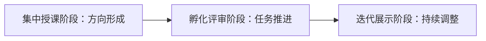
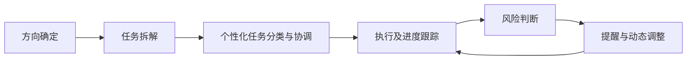
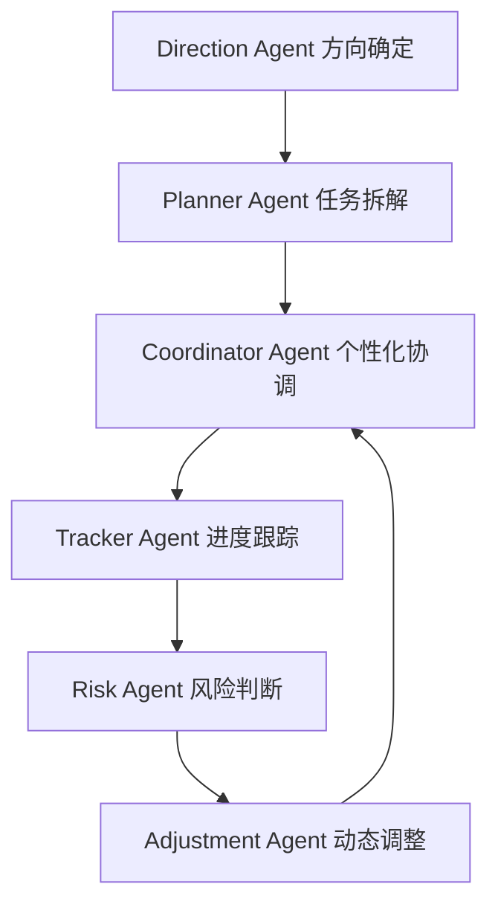
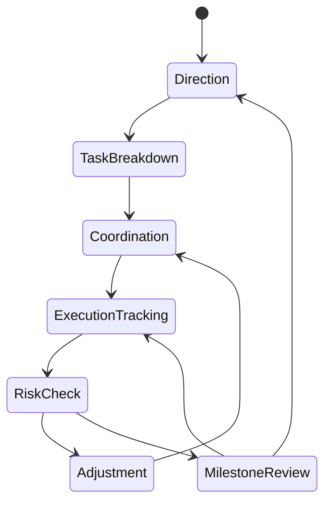
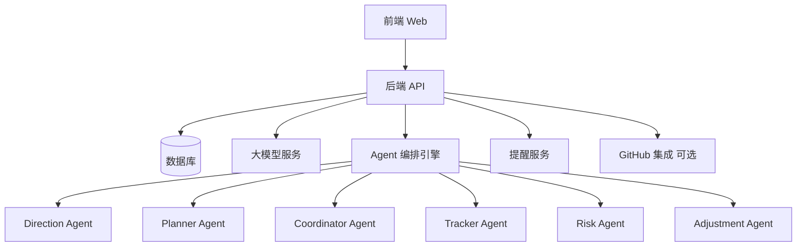

# ProjectFlow Agent 项目方案（新版）

> 面向大学生科创项目与 AI Agent 训练营团队的项目启动、协调与推进 Agent  
> 核心命题：**解决大学生项目“启动难、协调难、推进慢”的问题，让团队从模糊方向稳定推进到可交付成果。**

---

## 0. 项目基础信息

### 项目名称

# ProjectFlow Agent

### 一句话定位

**ProjectFlow Agent 是一个面向大学生科创团队和 AI Agent 训练营团队的项目启动、协调与推进 Agent，帮助团队完成方向确定、任务拆解、个性化任务分类与协调、执行进度跟踪、风险判断、提醒与动态调整。**

### 一句话路演卖点

> 让大学生团队不再卡在“项目怎么开始、任务怎么分、进度怎么推”的混乱阶段，由 Agent 持续帮助团队把项目稳定推进下去。

---

## 1. 项目背景

大学生项目经常不是败在“完全不会做”，而是败在推进过程：

- 项目一开始方向不清，迟迟定不下来。
- 有了方向后，不知道先做什么、后做什么。
- 任务拆得太粗，成员拿到任务也不知道怎么执行。
- 分工没有结合成员能力和时间，导致有人过载、有人无事可做。
- 进度依赖群聊口头同步，风险暴露太晚。
- 项目中期卡住后，不知道该调整方向、砍功能还是重新分配任务。
- 最后临近评审或展示，才发现核心链路没有闭合。

本项目不把重点放在“冲刺”，而是放在：

> **项目如何启动起来、团队如何协调起来、进度如何持续推进起来。**

---

## 2. 训练营周期对齐

### 已知训练营周期

| 阶段 | 时间 | 团队真实任务 | ProjectFlow Agent 支持 |
|---|---|---|---|
| 阶段一：集中授课 | 4 月下旬 ~ 5 月底 | 学习 Agent 基础、理解赛道、形成项目方向 | 方向探索、赛道匹配、可行性判断、初步任务框架 |
| 阶段二：项目孵化 / 导师辅导 / 中期评审 | 5 月底 ~ 6 月中旬 | 明确项目方案、推进 MVP、接受导师反馈 | 任务拆解、个性化分工、进度跟踪、风险判断、中期调整 |
| 阶段三：项目迭代 / 最终展示 / 结营仪式 | 6 月下旬 ~ 8 月初 | 持续迭代、完善 Demo、准备最终交付 | 动态调整、提醒机制、迭代计划、最终交付检查 |

### 阶段适配逻辑

ProjectFlow Agent 不是一次性生成计划，而是随着训练营阶段变化持续工作：

---

## 3. 项目定位

## 3.1 它是什么

ProjectFlow Agent 是一个：

- 项目启动 Agent
- 项目方向确定 Agent
- 团队任务拆解 Agent
- 个性化任务协调 Agent
- 项目进度跟踪 Agent
- 项目风险判断 Agent
- 提醒与动态调整 Agent

## 3.2 它不是什么

它不是：

- 普通 Todo List
- 普通项目管理看板
- 普通课程作业工具
- 普通 PRD 生成器
- 普通答辩 PPT 生成器
- 企业级 Jira / Asana / Linear 替代品
- 替学生直接完成项目的代写系统

## 3.3 核心边界

ProjectFlow Agent 不替代成员完成所有任务，而是解决团队推进中的结构化问题：

1. 方向不清时，帮助确定方向。
2. 任务太乱时，帮助拆解任务。
3. 分工不合理时，帮助协调任务。
4. 进度不可见时，帮助跟踪执行。
5. 风险暴露太晚时，提前判断风险。
6. 计划变化时，提醒并动态调整。

---

## 4. 核心问题定义

### 4.1 启动难

表现：

- 不知道选哪个方向。
- 不知道项目是否适合赛道。
- 不知道 MVP 应该做到什么程度。
- 不知道当前想法是否过大、过虚、过普通。

Agent 解决方式：

- 分析赛道和团队能力。
- 生成方向候选。
- 判断方向可行性。
- 收敛项目定位和 MVP 边界。

---

### 4.2 协调难

表现：

- 任务不知道怎么拆。
- 成员不知道自己该做什么。
- 有人任务过多，有人任务过少。
- 任务依赖关系不清。
- 人工协调成本高。

Agent 解决方式：

- 将项目拆成产品、前端、后端、Agent、数据、测试、展示等任务。
- 根据成员能力、时间、角色进行个性化任务分配。
- 生成个人任务清单和团队协作依赖图。
- 标记任务优先级、依赖关系和验收标准。

---

### 4.3 推进慢

表现：

- 进度只靠口头同步。
- 任务卡住没人发现。
- 风险到中后期才暴露。
- 计划变化后没有及时调整。
- 项目推进缺少节奏感和反馈机制。

Agent 解决方式：

- 持续跟踪任务状态。
- 收集成员进度和阻塞。
- 判断延期、范围、协作、技术和 Demo 风险。
- 主动提醒关键节点。
- 动态调整任务优先级和分工。

---

## 5. 核心主链路 / MVP

ProjectFlow Agent 的 MVP 主链路为：

---

## 6. 主链路详细设计

## 6.1 阶段一：方向确定

### 目标

帮助团队从模糊想法、训练营赛道和团队能力中确定一个可执行方向。

### 输入

- 训练营主题
- 赛道说明
- 团队人数
- 成员能力
- 开发周期
- 初步项目想法
- 是否需要 Demo
- 当前阶段

### Agent 行为

- 解析赛道要求。
- 判断初步想法是否匹配。
- 判断项目是否过大、过虚、过普通。
- 给出方向收敛建议。
- 生成项目方向卡。

### 输出

| 输出项 | 说明 |
|---|---|
| 项目方向 | 最终建议方向 |
| 一句话定位 | 项目是什么 |
| 目标用户 | 服务谁 |
| 核心问题 | 解决什么问题 |
| MVP 边界 | 第一版必须做什么 |
| 不做清单 | 当前阶段不做什么 |
| 方向风险 | 方向是否过大、过普通、难落地 |
| 下一步任务 | 方向确定后的第一批行动 |

---

## 6.2 阶段二：任务拆解

### 目标

把方向转化为团队可以执行的任务集合。

### Agent 行为

- 拆解功能任务。
- 拆解技术任务。
- 拆解数据任务。
- 拆解设计任务。
- 拆解测试任务。
- 拆解展示任务。
- 生成依赖关系。
- 标记任务优先级。

### 任务字段

| 字段 | 说明 |
|---|---|
| 任务名称 | 具体做什么 |
| 任务类型 | 产品 / 前端 / 后端 / Agent / 数据 / 测试 / 展示 |
| 任务目标 | 为什么做 |
| 输入材料 | 开始前需要什么 |
| 输出物 | 做完交付什么 |
| 验收标准 | 怎么判断完成 |
| 依赖任务 | 需要等哪些任务完成 |
| 截止时间 | 应完成时间 |
| 风险等级 | 高 / 中 / 低 |

---

## 6.3 阶段三：个性化任务分类与协调

### 目标

根据团队成员情况进行合理分工，而不是机械平均分配。

### 输入

- 成员技能
- 成员可投入时间
- 成员角色
- 成员偏好
- 当前任务负载
- 任务难度
- 任务依赖关系

### Agent 行为

- 判断每个任务适合谁。
- 判断哪些任务适合 AI / Coding Agent 辅助。
- 平衡成员负载。
- 识别协作瓶颈。
- 生成个人任务清单。
- 给出协调建议。

### 输出

| 输出 | 说明 |
|---|---|
| 团队任务总表 | 所有任务及状态 |
| 成员个人任务清单 | 每个人当前要做什么 |
| 人 / Agent 分工建议 | 哪些任务适合成员做，哪些适合 AI 辅助 |
| 协作依赖图 | 谁的任务会影响谁 |
| 负载风险提示 | 哪些成员过载，哪些任务无人负责 |

---

## 6.4 阶段四：执行及进度跟踪

### 目标

让团队持续掌握项目真实推进情况。

### Agent 行为

- 收集每日 / 阶段性进度。
- 跟踪任务状态变化。
- 识别任务延期。
- 识别阻塞问题。
- 记录产出证据。
- 判断核心链路完成度。

### 输入

- 任务状态
- 成员进度更新
- GitHub commit / issue 可选
- 文件 / 截图 / Demo 链接
- 阻塞问题
- 每日复盘文本

### 输出

- 项目进度看板
- 成员进度摘要
- 核心链路完成度
- 本周完成内容
- 阻塞任务列表
- 下阶段重点任务

---

## 6.5 阶段五：风险判断

### 目标

提前识别项目推进中的问题，而不是等项目失败后复盘。

### 风险类型

| 风险类型 | 判断依据 |
|---|---|
| 方向风险 | 方向过泛、过普通、与赛道不匹配 |
| 范围风险 | 必做功能过多，周期不足 |
| 进度风险 | 关键任务延期，依赖任务未完成 |
| 协作风险 | 成员负载不均，任务无人负责，单点依赖严重 |
| 技术风险 | 核心技术未验证，接口联调未完成 |
| Demo 风险 | 主链路不闭合，缺少可视化结果 |
| 评审风险 | 创新点不清，项目价值讲不清 |

### 输出

| 输出 | 说明 |
|---|---|
| 风险等级 | 低 / 中 / 高 |
| 风险原因 | 为什么有风险 |
| 影响范围 | 会影响哪些任务或里程碑 |
| 调整建议 | 应该砍功能、换方案、改分工还是加验证 |
| 提醒对象 | 应提醒队长、成员还是导师 |
| 处理优先级 | 哪个风险最先处理 |

---

## 6.6 阶段六：提醒与动态调整

### 目标

当项目状态变化时，主动提醒团队并给出调整方案。

### Agent 行为

- 生成截止时间提醒。
- 生成阻塞任务提醒。
- 生成阶段节点提醒。
- 自动建议砍功能。
- 自动重排任务优先级。
- 自动调整成员任务。
- 生成下一步行动清单。

### 典型场景

| 场景 | 动态调整建议 |
|---|---|
| 核心功能延期 | 砍掉非核心功能，优先打通主链路 |
| 某成员任务过载 | 转移部分低依赖任务给其他成员 |
| 技术方案卡住 | 提供替代实现方案 |
| 中期评审临近 | 生成中期检查清单 |
| 最终展示临近 | 生成展示前必须完成事项 |
| 方向偏离赛道 | 重新校准方向和项目表达 |

---

## 7. 核心功能模块

## 7.1 项目启动模块

- 录入训练营周期
- 录入赛道说明
- 录入团队信息
- 录入初始想法
- 生成方向卡

---

## 7.2 任务拆解模块

- 生成任务树
- 生成任务表
- 生成任务依赖
- 绑定训练营阶段
- 生成验收标准

---

## 7.3 个性化协调模块

- 成员能力录入
- 成员时间录入
- 任务适配分析
- 任务负载分析
- 人 / Agent 分工建议
- 协作瓶颈识别

---

## 7.4 进度跟踪模块

- 任务状态更新
- 进度说明提交
- 阻塞问题提交
- 产出证据上传
- 阶段进度总结

---

## 7.5 风险判断模块

- 方向风险
- 范围风险
- 进度风险
- 协作风险
- 技术风险
- Demo 风险
- 评审风险

---

## 7.6 提醒与动态调整模块

- 今日提醒
- 本周关键事项
- 延期提醒
- 阻塞提醒
- 调整建议
- 新旧计划对比

---

## 8. Agent 架构设计

## 8.1 多 Agent 协同结构

### Direction Agent

负责项目方向确定。

- 解析赛道
- 判断方向适配
- 收敛项目定位
- 输出方向卡

### Planner Agent

负责任务拆解。

- 生成任务树
- 标记优先级
- 生成依赖关系
- 生成验收标准

### Coordinator Agent

负责个性化协调。

- 分析成员能力
- 分配任务
- 平衡负载
- 判断人 / Agent 分工

### Tracker Agent

负责执行进度跟踪。

- 收集进度
- 更新状态
- 识别阻塞
- 输出进度摘要

### Risk Agent

负责风险判断。

- 识别方向、范围、进度、协作、技术、Demo、评审风险
- 输出风险等级和原因

### Adjustment Agent

负责提醒与动态调整。

- 生成提醒
- 重排任务
- 建议砍功能
- 调整下一步计划

---

## 9. 状态机设计

| 状态 | 目标 |
|---|---|
| Direction | 明确项目方向 |
| TaskBreakdown | 拆解任务 |
| Coordination | 协调分工 |
| ExecutionTracking | 跟踪执行 |
| RiskCheck | 判断风险 |
| Adjustment | 动态调整 |
| MilestoneReview | 中期 / 终期节点复盘 |

---

## 10. 技术路线

## 10.1 总体架构

## 10.2 前端

推荐：

- React / Next.js
- Tailwind CSS
- shadcn/ui
- React Flow
- Recharts
- TanStack Query

主要页面：

1. 项目列表
2. 新建项目向导
3. 方向确定页
4. 任务拆解页
5. 个性化协调页
6. 进度跟踪页
7. 风险看板页
8. 动态调整页

## 10.3 后端

推荐：

- FastAPI / Node.js
- SQLite / PostgreSQL
- Supabase 可选
- Redis 可选
- WebSocket 可选

核心接口：

| API | 功能 |
|---|---|
| POST /projects | 创建项目 |
| POST /projects/:id/direction | 生成方向建议 |
| POST /projects/:id/tasks | 生成任务拆解 |
| POST /projects/:id/coordinate | 生成任务协调方案 |
| PATCH /tasks/:id | 更新任务状态 |
| POST /projects/:id/progress | 提交进度更新 |
| POST /projects/:id/risk-check | 风险判断 |
| POST /projects/:id/adjust | 生成调整方案 |

---

## 11. 数据结构设计

## 11.1 projects

| 字段 | 含义 |
|---|---|
| id | 项目 ID |
| name | 项目名称 |
| stage | 当前阶段 |
| direction | 项目方向 |
| mvp_scope | MVP 范围 |
| training_phase | 训练营阶段 |
| deadline | 总截止时间 |
| current_milestone | 当前里程碑 |

## 11.2 members

| 字段 | 含义 |
|---|---|
| id | 成员 ID |
| project_id | 项目 ID |
| name | 成员姓名 |
| role | 团队角色 |
| skills | 技能标签 |
| available_time | 可投入时间 |
| preference | 任务偏好 |

## 11.3 tasks

| 字段 | 含义 |
|---|---|
| id | 任务 ID |
| project_id | 项目 ID |
| title | 任务名称 |
| type | 任务类型 |
| priority | 优先级 |
| owner_id | 负责人 |
| status | 状态 |
| due_date | 截止时间 |
| dependency_ids | 依赖任务 |
| acceptance | 验收标准 |
| risk_level | 风险等级 |

## 11.4 progress_updates

| 字段 | 含义 |
|---|---|
| id | 更新 ID |
| task_id | 任务 ID |
| member_id | 成员 ID |
| content | 进度说明 |
| evidence_url | 产出证据 |
| blockers | 阻塞问题 |
| created_at | 更新时间 |

## 11.5 risks

| 字段 | 含义 |
|---|---|
| id | 风险 ID |
| project_id | 项目 ID |
| risk_type | 风险类型 |
| level | 风险等级 |
| reason | 风险原因 |
| impact | 影响范围 |
| suggestion | 调整建议 |
| status | 是否已处理 |

---

## 12. MVP 版本

## 12.1 MVP 目标

做出一条完整主链路：

> 输入项目与团队信息 → 确定方向 → 拆解任务 → 个性化协调 → 跟踪进度 → 判断风险 → 生成提醒与调整建议

## 12.2 MVP 必做功能

1. 项目创建
2. 团队成员录入
3. 方向确定
4. 任务拆解
5. 个性化任务协调
6. 任务状态更新
7. 风险判断
8. 提醒与动态调整建议

## 12.3 MVP 可选功能

- GitHub issue 同步
- 日历提醒
- 邮件 / 飞书提醒
- 导师视图
- 中期评审检查清单
- 最终展示检查清单
- Markdown / PDF 报告导出

## 12.4 MVP 不做功能

先不做：

- 企业级权限系统
- 多组织空间
- 复杂即时通讯
- 自动完整编码
- 自动生成完整 PPT
- 移动端 App
- 高级甘特图

---

## 13. Demo 展示方案

## 13.1 Demo 场景

现场输入：

> 我们是 5 人 AI Agent 训练营团队，有 3 名大一计算机学生，一名成员擅长前端，一名成员擅长后端，一名成员熟悉大模型 API，另外两名成员负责产品和测试。训练营周期为 4 月下旬到 8 月初。我们想做一个校园通知处理 Agent，但还不确定方向是否合适，也不知道任务该怎么分。

ProjectFlow Agent 输出：

1. 方向是否适合赛道
2. 项目方向卡
3. MVP 边界
4. 任务拆解树
5. 成员个性化任务清单
6. 当前阶段计划
7. 风险判断
8. 提醒与动态调整建议

## 13.2 Demo 主流程

1. 创建项目
2. 输入训练营周期、赛道说明、团队成员和初始想法
3. 点击“确定方向”
4. 展示方向卡和 MVP 边界
5. 点击“任务拆解”
6. 展示任务树和依赖关系
7. 点击“个性化协调”
8. 展示每位成员任务清单和负载情况
9. 模拟一个关键任务延期
10. 点击“风险判断”
11. 展示风险等级和影响范围
12. 点击“动态调整”
13. 展示新旧计划对比和下一步行动

## 13.3 Demo 关键视觉

- 方向卡
- 任务拆解树
- 成员协调看板
- 项目进度面板
- 风险雷达图
- 动态调整卡片

---

## 14. 训练营阶段落地计划

## 14.1 阶段一：4 月下旬 ~ 5 月底

### 重点

项目启动与方向确定。

### Agent 支持

- 赛道解析
- 方向候选生成
- 方向可行性判断
- MVP 草案生成
- 初步任务框架

### 系统开发目标

- 项目创建
- 方向确定
- 基础任务拆解
- 可点击原型

---

## 14.2 阶段二：5 月底 ~ 6 月中旬

### 重点

项目孵化、导师辅导、中期评审。

### Agent 支持

- 任务细化
- 个性化任务分配
- 进度跟踪
- 风险判断
- 中期反馈转任务
- 阶段计划调整

### 系统开发目标

- 成员能力录入
- 个性化协调
- 进度跟踪
- 风险判断
- 中期评审 Demo

---

## 14.3 阶段三：6 月下旬 ~ 8 月初

### 重点

项目迭代、最终展示、结营仪式。

### Agent 支持

- 迭代任务规划
- 风险持续跟踪
- 提醒与动态调整
- 最终展示检查
- 项目复盘

### 系统开发目标

- 提醒模块
- 动态调整模块
- 新旧计划对比
- 最终展示版本

---

## 15. 7 天 MVP 开发计划

### Day 1：主流程和数据结构

- 确定产品定位
- 完成 6 阶段主链路
- 设计项目、成员、任务、进度、风险数据结构
- 编写方向确定 Prompt

### Day 2：方向确定模块

- 项目创建页面
- 团队信息录入
- 方向卡生成
- MVP 边界生成

### Day 3：任务拆解模块

- 任务树生成
- 任务表生成
- 依赖关系生成
- 验收标准生成

### Day 4：个性化协调模块

- 成员能力录入
- 任务推荐分配
- 负载分析
- 个人任务视图

### Day 5：进度跟踪模块

- 任务状态更新
- 阻塞问题提交
- 进度摘要生成
- 项目完成度统计

### Day 6：风险判断与动态调整

- 风险评分
- 风险原因解释
- 提醒生成
- 调整建议生成

### Day 7：Demo 打磨

- UI 美化
- 准备示例数据
- 完成演示脚本
- 准备答辩材料

---

## 16. 团队分工建议

| 角色 | 人数 | 负责内容 |
|---|---:|---|
| 产品负责人 | 1 | 项目定位、流程、文档、答辩 |
| 前端负责人 | 1-2 | 页面、看板、风险图、交互 |
| 后端负责人 | 1 | API、数据库、任务状态 |
| Agent 负责人 | 1 | Prompt、结构化输出、多 Agent 编排 |
| 测试与样例负责人 | 1 | 示例数据、训练营周期样例、风险案例 |

---

## 17. 创新点总结

### 17.1 场景创新

专门面向大学生科创项目和 AI Agent 训练营，不做泛企业项目管理。

### 17.2 链路创新

聚焦项目推进真实难点：

> 方向确定 → 任务拆解 → 个性化协调 → 进度跟踪 → 风险判断 → 动态调整

### 17.3 Agent 机制创新

系统不是单次生成计划，而是多个 Agent 持续参与项目推进过程。

### 17.4 协调机制创新

根据成员能力、时间、角色、偏好进行任务协调，而不是机械分配。

### 17.5 风险闭环创新

风险判断不是一句“可能延期”，而是绑定具体任务、影响范围和调整动作。

---

## 18. 答辩包装

## 18.1 PPT 结构

1. 标题页：ProjectFlow Agent
2. 问题：大学生项目启动难、协调难、推进慢
3. 典型场景：AI Agent 训练营团队项目
4. 痛点拆解：方向不清、任务不细、分工不准、风险发现晚
5. 解决方案：项目启动、协调与推进 Agent
6. 主链路：方向确定 → 任务拆解 → 个性化协调 → 进度跟踪 → 风险判断 → 动态调整
7. 产品 Demo
8. Agent 架构
9. 技术路线
10. 创新点与落地价值

## 18.2 开场话术

> 大学生项目最常见的问题，不是完全没有想法，也不是完全没有技术能力，而是项目启动难、协调难、推进慢。  
> ProjectFlow Agent 解决的就是这个问题。  
> 它围绕训练营项目周期，帮助团队确定方向、拆解任务、协调成员、跟踪进度、判断风险，并在项目变化时给出提醒和动态调整建议。

## 18.3 评委可能追问

| 问题 | 回答策略 |
|---|---|
| 这和普通项目管理工具有什么区别？ | 普通看板记录任务，我们的 Agent 从方向确定开始介入，并持续协调、判断风险、动态调整 |
| AI 分配任务可靠吗？ | AI 给出建议，团队可以人工修改；核心是降低启动和协调成本 |
| 为什么适合大学生团队？ | 大学生项目周期短、经验不足、角色不稳定，最需要结构化推进机制 |
| Agent 体现在哪里？ | 体现在持续分析项目状态、个性化协调任务、判断风险并主动调整 |
| 项目会不会太大？ | MVP 只做一条主链路，不做企业级项目管理系统 |

---

## 19. 最终推荐版本

### 最终项目名

# ProjectFlow Agent

### 最终定位

> 面向大学生科创团队和 AI Agent 训练营团队的项目启动、协调与推进 Agent。

### 最终主链路

> 方向确定 → 任务拆解 → 个性化任务分类与协调 → 执行及进度跟踪 → 风险判断 → 提醒与动态调整

### 最小可行版本

1. 输入项目和团队信息
2. 生成方向卡
3. 生成任务拆解
4. 根据成员能力协调任务
5. 支持任务状态更新
6. 自动判断风险
7. 输出提醒和调整建议

### 最终一句话卖点

> ProjectFlow Agent 让大学生团队在项目推进中始终知道：方向是否清楚、任务如何拆、谁该做什么、哪里有风险、下一步怎么调整。
