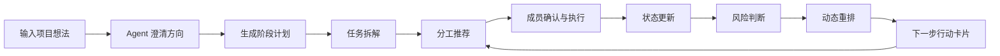

# Product Requirements Document: ProjectFlow MVP

## 1. Overview

**Product Name:** ProjectFlow  
**Version:** MVP 0.2  
**Document Status:** Draft  
**Target Milestone:** 2026-06-01 初步 MVP 闭环  

### 1.1 Product One-liner

ProjectFlow 帮助大学生项目小队把模糊想法变成清晰计划，并持续主动推进任务拆解、成员分工、进度跟踪、风险判断和动态调整。

### 1.2 Product Positioning

ProjectFlow 是一个面向大学生科创、竞赛、训练营和课程项目小队的 **项目主动推进 Agent**。

它不是传统任务看板，也不是通用项目管理平台。它的核心价值不是“记录任务”，而是持续回答：

- 现在项目应该往哪走？
- 下一步应该做什么？
- 谁适合负责什么？
- 每个成员做到什么程度了、下一步怎么做？
- 哪些任务有风险？
- 计划是否需要调整？
- 哪些内容现在应该砍掉或延后？

### 1.3 MVP Goal

在 2026-06-01 前完成一个可运行的初步 MVP 闭环：

> 团队成员各自创建账号  → 通过交互，提供个人信息、情况等  → 团队负责人创建workspace、邀请团队成员加入并输入项目信息、想法  → Agent 澄清方向给出方向卡 → 生成阶段计划/规划 → 拆解阶段任务 → 推荐分工 → 分工协调后确认  → 主动推进、提醒 → 手动更新状态 → 识别风险 → 动态重排计划 → 输出下一步行动卡片

MVP 的目标不是功能完整，而是证明 ProjectFlow 的核心判断：

> 大学生项目小队真正需要的不是一个新的看板，而是一个能把团队持续拉回可执行状态的推进机制。

---

## 2. Target Users

### 2.1 Primary Users

ProjectFlow MVP 的主要用户是正在做项目的大学生小团队，通常为 3–8 人。

典型项目类型包括：

- 科创项目
- 学科竞赛项目
- AI Agent 工程训练营项目类似的
- 课程小组项目
- 创新创业实践项目

### 2.2 User Roles

| Role       | Description                            | MVP Priority |
| ---------- | -------------------------------------- | ------------ |
| 队长 / 项目负责人 | 启动项目、workspace设置、填写初始信息、查看计划、协调分工、处理风险 | P0           |
| 普通队员       | 填写技能/时间/意向，确认分工、接收任务卡，更新任务状态           | P0           |
| 导师 / 指导老师  | 查看项目状态、给反馈、辅助评审                        | Not in MVP   |

### 2.3 User Pain Points

| Pain Point | Description        | MVP Response   |
| ---------- | ------------------ | -------------- |
| 方向不清       | 有想法，但不知道怎么收敛成可执行项目 | 项目方向澄清         |
| 任务拆不清      | 目标很大，但不知道第一步做什么    | 阶段计划 + 任务拆解    |
| 分工不稳定      | 成员能力、时间、意向不一致      | 成员信息收集 + 分工推荐  |
| 推进靠人催      | 项目推进依赖队长人工提醒       | 主动推进 + 下一步行动卡片 |
| 进度不可见      | 不知道谁做到了哪里          | 状态更新           |
| 风险暴露晚      | 临近评审才发现核心链路没闭合     | 风险判断 + 动态重排    |

---

## 3. Problem Statement

大学生项目团队的问题不是“没有工具记录任务”，而是“没有稳定的推进机制”。

在真实项目中，团队往往会经历以下过程：

1. 起初有一个模糊想法，但缺少结构化澄清。
2. 群聊里讨论很多，但信息分散，难以沉淀成计划。
3. 任务拆解依赖少数主动成员，普通成员不知道自己该做什么。
4. 分工只在项目初期做一次，后续状态变化后很少重新调整。
5. 成员有 blocker 或时间变化时，项目计划不会自动响应。
6. 临近评审才发现关键链路没有闭合。

ProjectFlow MVP 要解决的核心问题是：

> 如何让一个经验不足的大学生项目小队，从模糊方向进入可执行状态、进行高效的团队协作，并在状态变化后仍能持续被推进？

---

## 4. User Journey

### 4.1 Main Story

小林是一个大一计算机学生，正在和 5 个同学参加 AI Agent 工程训练营。团队已经有一个大概方向，但大家对要做什么、先做什么、谁负责什么都不够清楚。

一开始，他们在群聊里讨论了很多想法，但信息越来越散，任务也没有真正落到人。临近中期评审时，大家才发现核心功能还没有闭环，部分成员很忙，部分成员不知道自己该做什么。

小林打开 ProjectFlow，输入项目想法、截止日期、交付物要求、相关的文档/资料，然后邀请其他成员加入。成员填写个人技能、可用时间、意向和限制等个人情况信息。Agent 先追问关键问题，帮团队澄清项目边界，然后生成阶段计划、任务树和阶段分工建议。

经过成员协调和确认，团队完成阶段性的任务分工。后续 Agent 会持续跟踪项目状态，给出任务卡、启动指导、提醒和推进建议。在阶段任务完成后，会进入下一阶段任务，再进行一次分工。

几天后，成员手动更新任务状态。有人标记 blocker，有人可用时间减少。Agent 根据最新状态识别风险，指出哪些任务会影响中期评审，并建议砍掉低优先级功能、重排 owner、生成下一步行动卡片。

最后，团队知道现在该做什么、谁来做、为什么这样调整，项目重新回到可执行状态。

### 4.2 Core Usage Loop

---

## 5. MVP Scope

### 5.1 In Scope

MVP 只做 **单项目、单团队、单 workspace** 的完整闭环。

| Module                    | Description                                                                                                                                  | Priority |
| ------------------------- | -------------------------------------------------------------------------------------------------------------------------------------------- | -------- |
| Project Intake            | 输入项目想法、截止日期、交付物、相关资料/文档                                                                                                                      | P0       |
| Clarification             | 根据模糊项目想法追问关键问题，生成项目方向卡                                                                                                                       | P0       |
| Stage Plan Generator      | 生成阶段计划、阶段目标、关键里程碑                                                                                                                            | P0       |
| Task Breakdown            | 针对每个阶段拆解任务，标记优先级和简化依赖                                                                                                                        | P0       |
| Member Profile            | 创建账号并收集成员技能、时间、意向、限制等个人情况                                                                                                                    | P0       |
| Assignment Recommendation | 推荐任务 owner、备选 owner，并给出理由                                                                                                                    | P0       |
| Final Assignment          | 成员收到Agent的分工建议，选择接受/不接受，内部进行协调，确认最终分工。 具体就是，某个成员不接受Agent建议的分工，选择“不接受”，Agent进一步获取他的意愿的任务X。然后把发送通知给被建议分工到X的成员，看他是否愿意交换。                     | P0       |
| Active Push Cards         | 输出任务卡、启动建议、下一步行动、提醒                                                                                                                          | P0       |
| Check-in Update           | 分两种更新： - 在任务进行的过程中，（负责人）设定定期（每 x day）的check-in信息交互收集：今天做了什么（一句话），遇到卡点了吗（Blocker）？本周期（x day）还能投入多少时间(可用时间变化)； - 在阶段分工到的任务完成后，成员手动更新任务状态 | P0       |
| Risk Detection            | 根据状态识别延期、阻塞、负载、评审风险                                                                                                                          | P0       |
| Dynamic Replanning        | 根据风险给出砍需求、换 owner、调整优先级等建议                                                                                                                   | P0       |

### 5.2 Out of Scope

MVP 暂不做以下内容：

| Feature | Reason |
|---|---|
| GitHub / 飞书 / 日历集成 | 会显著增加工程复杂度，不影响 MVP 主闭环验证 |
| 多团队 workspace | 当前只需要演示一个团队项目 |
| 多 Agent 架构 | 调试成本高，不利于短期稳定 demo |
| 导师端深度协作 | 后续可通过评审材料导出间接满足 |
| 企业级项目管理功能 | 与产品定位不符，容易变成通用 PM 工具 |
| 完整权限系统 | 比赛作品阶段不需要复杂权限 |
| 正式上线与商业化部署 | 当前目标是本地稳定演示与评审展示 |

---

## 6. MVP Features

## 6.1 Feature 1: 项目方向澄清

**Priority:** P0  
**User Value:** 帮助团队从模糊想法进入可讨论、可执行的项目方向。

### Description

每个成员在创建账号的时候，会通过交互的方式收集他们的个人信息。
然后团队负责人把成员邀请到一个workspace，Agent自行调取workspace中成员的信息。
结合workspace中的成员信息和用户输入项目想法、截止日期、预期交付物和相关的资料/文档后，Agent 主动提出澄清问题，并生成项目方向卡。

### User Story

作为项目负责人，我希望 Agent 能根据模糊想法追问关键问题，并帮我整理项目方向，这样团队可以更快确定要做什么、不做什么。

### Acceptance Criteria

- [ ] 用户可以输入项目想法、截止日期、交付物、相关资料/文档。
- [ ] Agent 能提出关键澄清问题。
- [ ] Agent 能生成项目方向卡。
- [ ] 项目方向卡包含目标、用户、问题、交付物、边界和风险等重要信息。

---

## 6.2 Feature 2: 阶段计划生成

**Priority:** P0  
**User Value:** 把项目从一个大目标拆成可推进的阶段。

### Description

Agent 根据项目方向、截止时间和交付要求，生成阶段计划。

### User Story

作为项目负责人，我希望系统能帮我把项目拆成几个阶段，这样团队知道每个阶段的重点和交付物。

### Acceptance Criteria

- [ ] 系统能生成 3–5 个项目阶段。
- [ ] 每个阶段包含阶段目标、时间范围和交付物。
- [ ] 每个阶段有明确的完成标准。
- [ ] 用户可以手动确认或调整阶段计划。

---

## 6.3 Feature 3: 各阶段任务拆解与简化依赖

**Priority:** P0  
**User Value:** 让团队知道每个阶段具体要做什么。

### Description

系统针对每个阶段生成任务列表，并标注任务优先级、简化依赖关系和可延后项。

### User Story

作为队员，我希望看到自己当前阶段需要完成的具体任务，而不是只看到一个模糊目标。

### Acceptance Criteria

- [ ] 每个阶段能生成任务列表。
- [ ] 每个任务包含名称、描述、优先级、建议截止时间。
- [ ] 任务之间可显示简化依赖。
- [ ] 系统能标记 P0、P1、P2 任务。
- [ ] 系统能标记可砍或可延后任务。

---

## 6.4 Feature 4: 成员信息收集与分工推荐

**Priority:** P0  
**User Value:** 根据成员真实情况做更合理的任务分配。

### Description

Agent 根据任务要求和workspace中成员情况推荐 owner、备选 owner 和分配理由。

### User Story

作为项目负责人，我希望系统能根据成员能力和时间推荐任务分工，这样分配不会只靠主观感觉。

### Acceptance Criteria

- [ ] agent能够收集成员的技能、时间、意向、限制等个人情况信息。
- [ ] 每个任务能生成推荐 owner。
- [ ] 每个任务能生成备选 owner。
- [ ] 经负责人确认/初步调整后，把任务推荐推送给对应的成员。
- [ ] 每个推荐都有简短理由。
- [ ] 分工建议需要人工确认后才生效。
- [ ] 每个阶段都可以重新进行阶段性分工。

---

## 6.5 Feature 5: 状态更新、风险判断与动态重排

**Priority:** P0  
**User Value:** 当项目状态变化后，系统能主动发现问题并帮助团队调整。

### Description

成员手动更新任务状态、blocker 和可用时间变化。Agent 根据项目状态识别风险，并生成动态调整建议。

### User Story

作为项目负责人，我希望当成员进度变化或任务阻塞时，系统能主动指出风险并建议下一步调整。

### Acceptance Criteria

- [ ] 成员可以更新任务状态：Not Started / In Progress / Done / Blocked。
- [ ] 成员可以填写 blocker。
- [ ] 成员可以更新可用时间变化。
- [ ] Agent 能识别延期风险、依赖风险、负载风险和评审风险。
- [ ] Agent 能给出重排建议。
- [ ] 重排建议包含原因、影响范围和下一步行动。

---

## 6.6 Feature 6: 项目主动推进、提醒、建议

**Priority:** P0  
**User Value:** 让 Agent 成为推进项目的“节奏控制器”，而不是被动回答问题的工具。

### Description

Agent 基于项目阶段、任务状态、成员负载和截止日期等信息，持续生成推进建议、任务卡、启动指导和提醒。

### User Story

作为队员，我希望系统能告诉我现在该做什么、怎么开始、什么时候需要更新状态，这样我不会因为不知道下一步而拖延。

### Acceptance Criteria

- [ ] 每个成员能看到自己的任务卡。
- [ ] 每张任务卡包含任务目标、启动建议、完成标准和截止时间。
- [ ] 系统能生成团队层面的下一步行动卡片。
- [ ] 系统能在风险出现时生成提醒。
- [ ] 系统能解释为什么现在要推进这件事。

---

## 7. Key Screens

| Screen               | Purpose     | Key Elements             |
| -------------------- | ----------- | ------------------------ |
| Project Intake       | 创建项目，输入基础信息 | 项目想法、截止日期、交付物、成员邀请       |
| Member Profile       | 收集成员情况      | 技能、可用时间、意向、限制            |
| Clarification View   | Agent 澄清方向  | 澄清问题、项目方向卡、确认按钮          |
| Plan Board           | 展示阶段计划和任务树  | 阶段、里程碑、任务、依赖、优先级         |
| Assignment View      | 展示分工建议      | owner、备选 owner、分配理由、确认状态 |
| Dashboard            | 项目推进总览      | 当前阶段、任务状态、风险、下一步行动       |
| Check-in & Risk View | 更新状态并触发风险判断 | 状态更新、blocker、风险卡、重排建议    |
| Action Cards         | 主动推进入口      | 我的任务卡、团队下一步、启动建议、提醒      |

---

## 8. Non-Functional Requirements

### 8.1 Platform

- Web 优先
- 桌面浏览器演示优先
- 不要求移动端深度适配

### 8.2 Performance

- 页面基础交互响应流畅。
- Agent 输出过程需要可视化，避免用户误以为系统卡死。
- 交互人性，动画流程精美。

### 8.3 Privacy & Security

MVP 阶段暂不重点考虑隐私和安全问题。

### 8.4 Explainability

MVP 必须体现 Agent 的可解释性：

- 为什么这样拆任务？
- 为什么这样分工？
- 为什么认为有风险？
- 为什么建议重排？
- 下一步行动基于哪些状态？

可通过 Agent Timeline、风险卡说明、分工理由等方式展示。

---

## 9. Success Metrics

### 9.1 MVP Success Metrics

| Metric   | Target             | Measurement            |
| -------- | ------------------ | ---------------------- |
| 完整闭环可运行  | 2026-06-01 前完成初步闭环 | 从输入项目到输出下一步行动卡片        |
| Demo 稳定性 | 2026-06-07 前稳定跑通   | 本地完整演示不卡死、不崩溃          |
| 主动推进可感知  | 至少展示 1 个主动推进场景     | Agent 主动给出任务卡、提醒或下一步建议 |
| 风险重排可展示  | 至少展示 1 个状态变化后的重排场景 | blocker 或时间变化后生成新建议    |
| 团队可直接使用  | 任务分工和推进建议能被团队采纳    | 团队成员能按卡片执行             |

---

## 10. 开发 Plan

### 10.1 Phase 1: 初步闭环，完成MVP，目标 2026-06-01

| Task              | Output                                              |
| ----------------- | --------------------------------------------------- |
| 定义基础数据结构          | Project / Member / Stage / Task / Risk / ActionCard |
| 完成 Project Intake | 可输入项目想法、截止日期、交付物                                    |
| 完成成员信息收集          | 可填写技能、时间、意向、限制                                      |
| 完成 Agent 基础链路     | 澄清、计划、拆解、分工                                         |
| 完成状态更新            | 可手动更新任务状态                                           |
| 完成基础风险判断          | blocker / 延期 / 负载风险                                 |
| 完成下一步行动卡片         | 输出团队和个人下一步动作                                        |

### 10.2 Phase 2: Demo 稳定化，目标 2026-06-07

| Task     | Output         |
| -------- | -------------- |
| 打磨主流程 UI | 演示路径清晰         |
| 增强主动推进表现 | 任务卡、提醒、启动建议更明确 |
| 增强风险重排场景 | 可展示状态变化前后对比    |
| 准备种子数据   | 保证演示稳定         |
| 修复阻断 bug | 本地稳定跑通         |

### 10.3 Phase 3: 评审材料，目标 2026-06-09

| Task | Output |
|---|---|
| README | 说明产品定位、运行方式、核心功能 |
| 演示视频 | 展示完整闭环和风险重排场景 |
| 项目说明 | 解释为什么这是 Agent，而不是普通看板 |

---

## 11. Quality Standards

### 11.1 Product Quality

ProjectFlow MVP 不接受：

- 只有静态页面，没有完整流程。
- 只有任务列表，没有主动推进。
- 只有 AI 文案生成，没有状态变化后的判断。
- 只有一次性计划，没有后续更新与重排。
- 风险判断没有理由。
- 分工推荐没有依据。

### 11.2 Demo Quality

Demo 必须能展示：

- 一个真实项目从模糊想法进入计划。
- 一个成员状态变化或 blocker 出现。
- Agent 主动发现风险。
- Agent 给出重排建议。
- 团队获得明确的下一步行动。

---

## 12. MVP Definition of Done

MVP 完成标准：

- [ ] 可以创建账号并通过交互收集成员信息。
- [ ] 可以创建一个项目并邀请成员。
- [ ] 可以填写项目想法、截止日期、上传相关资料/文档。
- [ ] Agent 可以生成澄清问题和方向卡。
- [ ] Agent 可以生成阶段计划。
- [ ] Agent 可以拆解各阶段任务。
- [ ] Agent 可以推荐分工并说明理由。
- [ ] 成员和负责人可以协调确认最终分工。
- [ ] 成员可以手动更新状态。
- [ ] Agent 可以基于项目阶段、任务状态、成员负载和截止日期等信息，持续生成推进建议、任务卡、启动指导和提醒。
- [ ] Agent 可以识别至少 3 类风险。
- [ ] Agent 可以生成动态重排建议。
- [ ] Agent 可以生成下一步行动卡片。
- [ ] 本地可稳定完成一次完整演示。

---

## 13. Brief Next-Step Note

MVP 完成后，ProjectFlow 将进入 demo 优化和最终展示增强阶段。后续重点不是立即扩成通用项目管理平台，而是在保留“主动推进”核心体验的基础上，增强演示稳定性、可解释性、真实感和外部集成能力。

---

*Created: 2026-05-27*  
*Status: Draft — Ready for Technical Design*  

---
