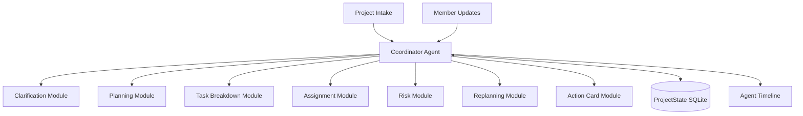

# Product Requirements Document: ProjectFlow MVP → Demo → Final Product

## 1. Overview

**Product Name:** ProjectFlow  
**Document Type:** Product Evolution PRD  
**Scope:** MVP → 可演示 Demo → 最终展示产品  
**Timeline:** 2026-06-01 → 2026-07-31  
**Document Status:** Draft  

### 1.1 Product Vision

ProjectFlow 是一个面向大学生项目小队的主动推进型 AI Agent。它帮助团队从模糊项目想法进入清晰计划，并在执行过程中持续理解目标、成员能力、时间约束和风险信号，主动给出下一步行动、分工建议、风险判断和动态调整方案。

### 1.2 Core Product Thesis

大学生项目小队最缺的不是任务管理工具，而是项目推进机制。

ProjectFlow 要验证的核心判断是：

> 如果 AI Agent 能持续把项目状态转化为下一步行动，学生团队就能更早发现风险、更清楚地分工，并更稳定地推进到评审和交付。

### 1.3 Product Evolution Logic

ProjectFlow 的产品演进分为三个阶段：

| Stage | Date | Goal | Product Focus |
|---|---:|---|---|
| MVP | 2026-06-01 | 跑通初步闭环 | 证明主动推进链路可运行 |
| Demo | 2026-06-07 / 2026-06-09 | 稳定展示和评审材料 | 证明产品价值可被评委感知 |
| Final Product | 2026-07-31 | 增强真实感和可信度 | 证明产品有继续迭代潜力 |

---

## 2. Strategic Positioning

### 2.1 What ProjectFlow Is

ProjectFlow 是：

- 学生项目小队的主动推进 Agent
- 模糊想法到下一步行动的转换器
- 队长和成员之间的协调辅助层
- 项目状态、风险和行动建议的持续生成器
- 面向科创/竞赛/训练营项目的轻量推进系统

### 2.2 What ProjectFlow Is Not

ProjectFlow 不是：

- 通用 Notion 替代品
- Trello / Jira / Linear 克隆
- 企业级项目管理 SaaS
- 完全自动替人做项目的工具
- 多 Agent 炫技系统
- 复杂协作平台

### 2.3 Differentiation

| Product Type | Solves | Does Not Solve Well | ProjectFlow Advantage |
|---|---|---|---|
| Notion | 文档和知识管理 | 主动推进、分工重排 | 更聚焦学生项目推进 |
| Trello | 轻量任务记录 | 方向澄清、风险判断 | 从模糊想法生成行动 |
| Linear | 成熟产品团队节奏 | 学生团队低门槛启动 | 更适合经验不足的小队 |
| 飞书/微信群 | 沟通协作 | 状态结构化和风险视图 | 把消息转成状态和下一步 |
| Asana/Motion | 企业项目自动化 | 学生场景适配 | 更轻、更聚焦评审交付 |

---

## 3. Users and Use Cases

### 3.1 Primary Persona: 大学生项目负责人

**Profile:**

- 大一到大三学生
- 正在参加课程项目、竞赛、科创或训练营
- 通常是项目的发起者或事实负责人
- 有一定执行意愿，但项目管理经验不足

**Needs:**

- 快速把方向说清楚
- 把任务拆到可执行粒度
- 知道谁适合做什么
- 及时发现项目风险
- 减少自己人工催促的负担

### 3.2 Secondary Persona: 普通队员

**Profile:**

- 技能、时间和参与意愿不完全一致
- 不一定知道项目全局
- 需要明确任务、启动建议和完成标准

**Needs:**

- 知道自己当前应该做什么
- 理解任务为什么分给自己
- 知道如何开始
- 可以方便更新状态和 blocker

### 3.3 Future Persona: 导师 / 评审 / 指导老师

**Profile:**

- 不参与日常执行
- 需要快速了解项目进展、风险和产出
- 可能提供反馈或评审意见

**Needs:**

- 查看项目摘要
- 快速了解风险
- 提供反馈并转化为任务

---

## 4. Product Roadmap

## 4.1 Stage 1: MVP，目标 2026-06-01

### Goal

完成一个初步可运行的项目推进闭环。

### Core Scenario

> 用户创建项目 → 填写项目想法和成员信息 → Agent 澄清方向 → 生成阶段计划 → 拆解任务 → 推荐分工 → 生成任务卡和推进建议 → 成员更新状态 → Agent 识别风险 → 生成重排建议和下一步行动

### Required Capabilities

| Capability | Requirement | Priority |
|---|---|---|
| 项目创建 | 输入项目想法、截止日期、交付物 | P0 |
| 成员信息 | 填写技能、时间、意向、限制 | P0 |
| 方向澄清 | Agent 提问并生成方向卡 | P0 |
| 阶段计划 | 生成阶段、里程碑、交付物 | P0 |
| 任务拆解 | 各阶段任务列表、优先级、依赖 | P0 |
| 分工推荐 | owner、备选 owner、理由 | P0 |
| 主动推进 | 任务卡、启动建议、下一步行动 | P0 |
| 状态更新 | done、blocked、available hours | P0 |
| 风险判断 | 延期、依赖、负载、评审风险 | P0 |
| 动态重排 | 砍需求、换 owner、调优先级 | P0 |

### MVP Acceptance Criteria

- [ ] 可以跑通单项目闭环。
- [ ] Agent 输出不是一次性文案，而能响应状态变化。
- [ ] 至少能演示一次状态变化后的风险判断。
- [ ] 至少能输出个人任务卡和团队下一步行动。
- [ ] 本地环境可运行。

---

## 4.2 Stage 2: Demo，目标 2026-06-07 / 2026-06-09

### Goal

把 MVP 打磨成稳定、可讲、可展示、可评审的 demo。

Demo 阶段的目标不是增加大量功能，而是让评委清楚看到：

> ProjectFlow 不是普通看板，而是一个能根据项目状态持续主动推进的 Agent。

### Demo Narrative

Demo 应该围绕一个完整故事展开：

1. 团队有一个模糊项目想法。
2. ProjectFlow 帮团队澄清方向。
3. ProjectFlow 生成阶段计划和任务分工。
4. 成员收到任务卡和启动建议。
5. 某个成员出现 blocker 或可用时间下降。
6. ProjectFlow 主动发现风险。
7. ProjectFlow 给出重排建议。
8. 团队获得新的下一步行动。
9. 导出中期评审说明或项目摘要。

### Demo Enhancements

| Area | Enhancement | Priority |
|---|---|---|
| UI Flow | 主流程更顺，减少跳转混乱 | P0 |
| Agent Timeline | 展示“读取状态 → 判断风险 → 建议动作” | P0 |
| Risk Scenario | 预设 blocker / 时间减少场景 | P0 |
| Before/After Plan | 展示计划重排前后变化 | P0 |
| Action Cards | 强化任务卡、提醒和启动建议 | P0 |
| Summary Export | 生成中期评审摘要 / README 可用内容 | P1 |
| Seed Data | 准备稳定演示项目数据 | P0 |
| Backup Plan | 录屏、截图、静态 fallback | P0 |

### Demo Screens

| Screen | Demo Purpose |
|---|---|
| Home / Project Dashboard | 一眼看出当前项目状态 |
| Project Intake | 展示模糊想法如何进入系统 |
| Agent Clarification | 展示 Agent 主动追问 |
| Plan Board | 展示阶段、任务、依赖 |
| Assignment View | 展示分工推荐和理由 |
| Member Task Cards | 展示主动推进到个人 |
| Risk & Replan | 展示状态变化后的风险判断和重排 |
| Agent Timeline | 展示 Agent 决策过程 |
| Summary Export | 输出评审摘要 |

### Demo Success Criteria

| Metric | Target |
|---|---|
| 演示稳定性 | 5 分钟内完整跑通 |
| 价值表达 | 1 分钟内讲清“主动推进” |
| Agent 感知 | 评委能看到状态变化后的判断与动作 |
| 可解释性 | 每个关键建议都有原因 |
| 备份可靠 | 现场失败时有录屏和截图兜底 |

---

## 4.3 Stage 3: Final Product，目标 2026-07-31

### Goal

在最终展示前，将 ProjectFlow 从“可演示 demo”增强为“更真实、更可信、更完整的学生项目推进工具”。

最终产品不追求企业级完整度，而追求三个增强：

1. **真实感增强**：更像真实团队会用的工具。
2. **可信度增强**：Agent 判断更可解释、更稳定。
3. **体验增强**：主动推进更自然、更有记忆、更有节奏。

### Final Product Direction

| Direction | Description | Priority |
|---|---|---|
| 外部系统集成 | GitHub / 飞书 / 日历三选一或多选 | P0 |
| 周期性 Check-in | 定期询问成员状态并触发风险判断 | P0 |
| 历史版本对比 | 展示计划前后变化 | P1 |
| 更细风险规则 | 任务延期、依赖阻塞、成员负载、评审风险 | P0 |
| 导师反馈整理 | 将导师建议转化为任务或调整项 | P1 |
| Summary Export 增强 | 周报、评审摘要、项目复盘 | P1 |
| 体验与动效优化 | 任务卡分发动画、风险浮现、重排对比 | P1 |
| Agent 流程优化 | 更稳定的提示词、结构化输出、人工确认点 | P0 |

---

## 5. Feature Evolution

### 5.1 Active Push Evolution

主动推进是 ProjectFlow 的一级核心能力，应从 MVP 到最终产品持续增强。

| Stage | Active Push Capability |
|---|---|
| MVP | 生成任务卡、下一步行动、基础提醒 |
| Demo | 明确展示任务卡如何分发给成员，以及状态变化后如何触发推进 |
| Final | 增加周期性 check-in、自动生成每日/阶段推进建议、历史推进记录 |

### 5.2 Risk Detection Evolution

| Stage | Risk Capability |
|---|---|
| MVP | 基础风险：blocked、延期、可用时间减少、关键任务未完成 |
| Demo | 预设一个典型评审风险场景，展示重排前后变化 |
| Final | 更细规则：依赖链风险、成员负载风险、scope creep、评审材料缺口 |

### 5.3 Assignment Evolution

| Stage | Assignment Capability |
|---|---|
| MVP | 根据技能、时间、意向推荐 owner 和备选 owner |
| Demo | 展示分工理由和人工确认流程 |
| Final | 加入历史表现、任务完成情况、成员偏好变化，支持阶段性重新分工 |

### 5.4 Explainability Evolution

| Stage | Explainability Capability |
|---|---|
| MVP | 分工理由、风险理由、重排理由 |
| Demo | Agent Timeline 展示证据-判断-动作 |
| Final | 计划版本对比、决策日志、可回滚/可确认机制 |

---

## 6. Roadmap by Date

### 6.1 Now → 2026-06-01: Initial MVP

| Workstream | Tasks | Output |
|---|---|---|
| Data Model | Project、Member、Stage、Task、Risk、ActionCard | 基础状态结构 |
| Core Agent | 澄清、规划、拆解、分工、风险、重排 | Coordinator Agent 初版 |
| Frontend Flow | Intake、Plan、Assignment、Dashboard、Risk | 初步可点击流程 |
| State Update | 成员手动更新状态 | 状态变化入口 |
| Active Push | 任务卡、下一步行动 | 主动推进初版 |
| Local Demo | 一台电脑跑通 | 初步 MVP 闭环 |

### 6.2 2026-06-01 → 2026-06-07: Demo Optimization

| Workstream | Tasks | Output |
|---|---|---|
| Demo Script | 设计完整演示故事 | 5 分钟演示路径 |
| UI Polish | 优化主流程视觉层级 | 更清晰可讲 |
| Agent Timeline | 决策日志可视化 | 可解释 Agent |
| Risk Scenario | blocker / 时间减少 / 评审风险 | 风险重排演示 |
| Seed Data | 固定示例项目 | 稳定演示数据 |
| Bug Fix | 修复主流程阻断问题 | 可演示 demo |

### 6.3 2026-06-07 → 2026-06-09: Review Preparation

| Workstream | Tasks | Output |
|---|---|---|
| README | 项目定位、运行方式、功能说明 | 可提交说明 |
| Demo Video | 录制完整流程 | 线上评审材料 |
| Product Explanation | 解释主动推进和 Agent 价值 | 评审文案 |
| Backup Materials | 截图、录屏、静态 fallback | 风险兜底 |

### 6.4 2026-06-10 → 2026-07-31: Final Product Enhancement

| Workstream | Tasks | Output |
|---|---|---|
| External Integration | GitHub / 飞书 / 日历至少选择一个 | 更真实的数据来源 |
| Periodic Check-in | 定期状态收集与推进建议 | 更强主动推进 |
| Risk Rules | 增强风险判断规则 | 更可信的 Agent |
| Version Comparison | 展示计划调整前后变化 | 更强可解释性 |
| Mentor Feedback | 导师反馈转任务 | 更贴近评审场景 |
| UX Polish | 动效、任务卡、风险卡、仪表盘 | 更完整产品体验 |
| User Testing | 找少量同学试用 | 真实反馈 |

---

## 7. Product Architecture Direction

### 7.1 MVP Architecture

MVP 推荐采用：

> Coordinator Agent + State Machine + Tool Modules

核心结构：

### 7.2 Architecture Principles

- 使用单 Coordinator Agent，不做复杂多 Agent。
- 固定阶段用 workflow / state machine 保证稳定性。
- 阶段内部允许 Agent 做推理和建议生成。
- 所有关键 AI 输出需要结构化。
- 所有关键建议需要人工确认。
- 所有关键判断需要解释原因。
- 优先本地稳定演示，而不是过早上线。

### 7.3 Suggested Stack

| Layer | Recommended Stack |
|---|---|
| Frontend | Next.js + React + TypeScript |
| Backend | FastAPI |
| State Storage | SQLite |
| Agent Orchestration | LangGraph 或轻量状态机 |
| Agent Pattern | Single Coordinator Agent |
| Deployment | 本地演示优先，云端预览次之 |

---

## 8. Final Product Feature Set

### 8.1 Core Features

| Feature | Final Product Expectation |
|---|---|
| Project Intake | 支持更完整项目背景、截止日期、评审要求、资源约束 |
| Member Profile | 支持技能、时间、意向、历史任务表现 |
| Direction Clarification | 支持多轮澄清和方向卡版本保存 |
| Stage Planning | 支持阶段计划编辑、确认、版本管理 |
| Task Breakdown | 支持任务树、依赖、优先级、可砍项 |
| Assignment | 支持阶段性重新分工、负载平衡、理由解释 |
| Active Push | 支持任务卡、提醒、启动建议、周期性推进 |
| Check-in | 支持周期性状态更新和 blocker 收集 |
| Risk Detection | 支持多维风险卡和风险等级 |
| Replanning | 支持计划前后对比和调整确认 |
| Summary Export | 支持周报、中期评审、最终展示摘要 |
| External Integration | 至少支持一个外部数据来源 |

---

## 9. Quality Standards

### 9.1 Product Quality Standards

ProjectFlow 后续版本必须坚持：

- 主动推进优先于功能堆叠。
- 学生场景优先于企业级复杂度。
- 可解释优先于黑箱自动化。
- 低门槛优先于高度自定义。
- 状态变化后的调整优先于一次性计划生成。

### 9.2 Agent Quality Standards

Agent 输出必须满足：

- 有明确输入依据。
- 有清晰输出结构。
- 有可解释理由。
- 有人工确认点。
- 能响应状态变化。
- 不承诺自动解决人际矛盾或真实执行力问题。

### 9.3 Demo Quality Standards

最终展示必须证明：

- ProjectFlow 能从模糊想法生成可执行计划。
- ProjectFlow 能根据成员信息给出合理分工。
- ProjectFlow 能把任务推进到成员个人。
- ProjectFlow 能识别项目风险。
- ProjectFlow 能在状态变化后动态调整。
- ProjectFlow 能展示 Agent 的判断过程。

---

## 10. Risks and Mitigation

| Risk | Impact | Mitigation |
|---|---|---|
| 功能范围过大 | 无法按时完成 | 坚持单项目、单团队、单 workspace |
| Agent 输出不稳定 | 演示翻车 | 使用结构化输出、种子数据、fallback |
| 主动推进不明显 | 产品像普通看板 | 把任务卡、提醒、重排建议作为核心展示 |
| UI 太复杂 | 评委看不懂 | 保持主流程单线清晰 |
| 多 Agent 过早引入 | 调试成本上升 | MVP 坚持单 Coordinator Agent |
| 外部集成耗时 | 抢占核心体验 | 最终展示前只选 1 个集成优先做深 |
| 团队执行不稳定 | 进度延误 | 用 ProjectFlow 自己推进 ProjectFlow 项目 |

---

## 11. Final Product Definition of Done

到 2026-07-31，ProjectFlow 最终展示版本应满足：

- [ ] 至少支持一个完整项目从创建到风险重排。
- [ ] 至少支持 3–8 人团队的成员信息和任务分工。
- [ ] 至少支持一个外部系统集成或模拟真实数据接入。
- [ ] 支持周期性 check-in 或阶段性状态更新。
- [ ] 支持 Agent Timeline 或等价决策日志。
- [ ] 支持计划前后对比。
- [ ] 支持中期/最终评审摘要导出。
- [ ] 至少有 2 个稳定 demo 场景。
- [ ] 至少有一次真实同学试用或内部团队使用记录。
- [ ] 能清楚解释 ProjectFlow 与普通看板/Notion/Trello 的区别。

---

## 12. Recommended Final Demo Structure

最终展示建议采用以下结构：

1. **问题开场**：大学生项目小队缺的不是看板，而是推进机制。
2. **输入模糊想法**：展示 ProjectFlow 如何澄清项目。
3. **生成计划**：展示阶段、任务和分工。
4. **主动推进**：展示任务卡分发、启动建议、提醒。
5. **状态变化**：成员出现 blocker 或时间减少。
6. **风险判断**：Agent 识别关键风险。
7. **动态重排**：Agent 给出砍需求、换 owner、调整优先级。
8. **可解释 Timeline**：展示证据-判断-动作。
9. **评审摘要导出**：展示最终材料能力。
10. **总结定位**：ProjectFlow 是学生项目的主动推进 Agent。

---

## 13. Next Steps

### Immediate

1. 根据 MVP PRD 创建 Technical Design Document。
2. 定义 ProjectState 数据模型。
3. 定义 Coordinator Agent 的输入输出 schema。
4. 设计 5 分钟 demo 主路径。
5. 准备 ProjectFlow 自己作为种子项目数据。

### After MVP

1. 打磨 demo 稳定性。
2. 加入 Agent Timeline。
3. 优化主动推进任务卡体验。
4. 准备 README 和演示视频。
5. 规划最终展示前的外部集成。

---

*Created: 2026-05-27*  
*Status: Draft — Ready for Technical Design and Roadmap Planning*
